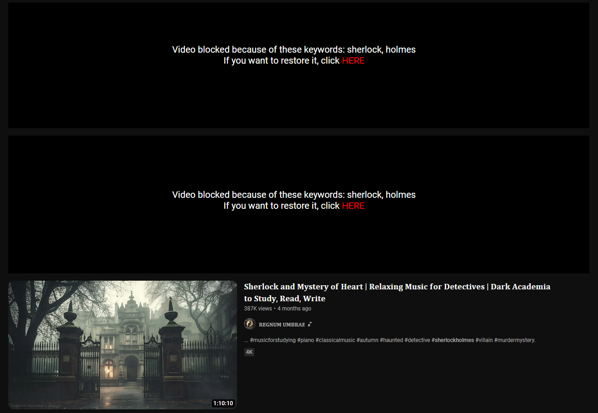

# No spoiler extension
## Introduction
This extension is made to protect you from spoilers on YouTube.

You can set banned keywords. Videos that contain any of them in their title will be hidden. We'll tell you which keywords are there. Of course, you can restore the video if you want.

You can also set exceptions. Videos that contain any of them in their title will NOT be hidden even if they also contain some banned keywords.

We hope you enjoy this extension! If not, please let us know what is wrong.

## Usage examples
Suppose you want to protect yourselves from Sherlock Holmes spoilers. With the "No spoiler" extension, you can ban keywords associated with the franchise, for example:

While you want to block Sherlock Holmes-related videos, you also like to listen to the music from the show. That's why you decided to add several exceptions that will prevent our extension from blocking any soundtrack videos, for example:

Note that keywords and exceptions are case-insensitive, so you don't need to worry about rewriting them in all possible cases.

Now, let's go to YouTube and see how our extension works:

As you can see, our extension detected banned keywords in the first 2 videos. Even though the third one contains the "sherlock" keyword, which we have blocked, it also has the "music" exception. If the video holds at least one exception in its title, our extension does not hide it.

Of course, you can restore the videos that our extension blocked by clicking the "HERE" button:

## Installation
Firstly, be aware that our extension only works in browsers written in Chromium (Chrome, Opera, Microsoft Edge, etc). For example, Firefox is not supported in our extension.

To install the extension, click the "Code" button at the top of this page and select "Download ZIP":

After that, unarchive the file to the folder of your choice.

Then, go to the extension manager in your browser (`chrome://extensions/` for Chrome, `opera://extensions` for Opera, `edge://extensions/` for Edge, etc). Then, in some browsers, you have to turn on the "Developer mode" in the top right corner. Then, click "Load unpacked" and select the folder to which you installed our extension. Our extension will appear in your extensions list. Make sure to turn it on. That's it! Enjoy our extension!

